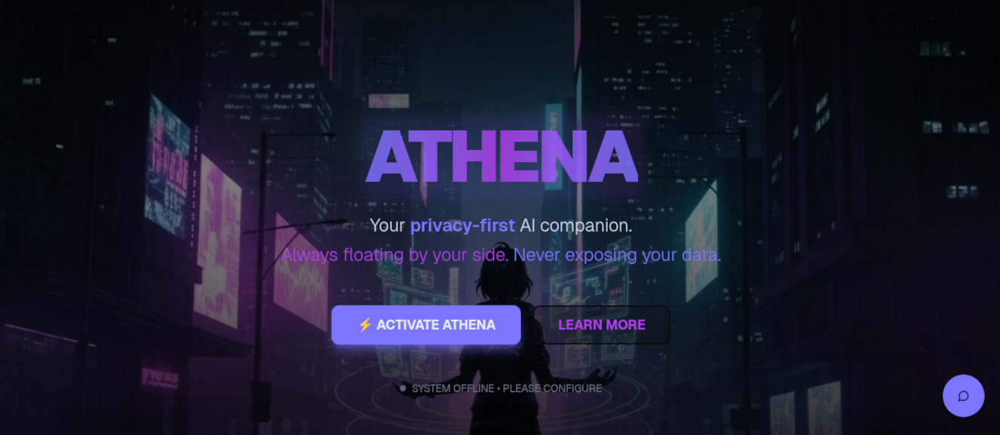
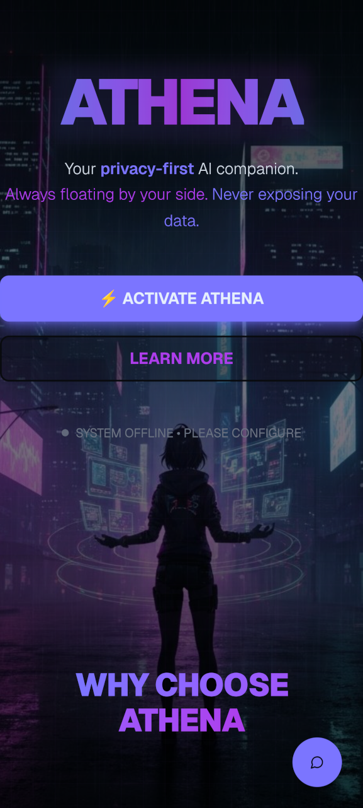

<h1 align="center">Athena — Privacy-First AI Companion</h1>

<p align="center">
  A visually charming, personality-driven AI companion built with privacy, user agency, and emotional safety as core principles.
</p>

<p align="center">
  <strong>Try it live: <a href="https://athena-seven-beta.vercel.app">https://athena-seven-beta.vercel.app</a></strong>
</p>

<table align="center">
  <tr>
    <td></td>
    <td></td>
  </tr>
  <tr>
    <td align="center"><em>Desktop</em></td>
    <td align="center"><em>Mobile</em></td>
  </tr>
</table>

---

## ✨ Features

### 💬 Conversation & Intelligence
- Multi-turn conversation with encrypted persistent memory (IndexedDB, AES-GCM, PBKDF2 600k iterations)
- Configurable memory window (1–10 messages)
- Document & image attachments (txt, md, json, csv, pdf, images, code files)
- Web search — OpenAI via Responses API, Groq via compound-beta
- Image generation — inline via OpenAI `image_generation` tool with download overlay
- Emotion detection — post-response classification displayed as an emoji badge
- Token usage display per message
- Markdown rendering with syntax highlighting and emoji support

### 🎙️ Voice I/O
- **STT:** Groq / OpenAI Whisper — tap-to-record with waveform visualizer
- **TTS:** OpenAI TTS (6 voices) and ResembleAI Chatterbox
- Per-message audio replay
- TTS never reads URLs aloud

### 🎭 Avatar System

| Format | Description |
|---|---|
| `static-2d` | Static image with CSS float animation |
| `animated-2d` | React Three Fiber canvas animation |
| `animated-3d` | 2.5D R3F plane mesh with custom GLSL shaders — parallax head-tracking, per-emotion animations |
| `live-avatar` | Decart WebRTC real-time lip-sync avatar |

### 🔒 Privacy & Security
- All data encrypted locally — AES-GCM + PBKDF2 600k iterations
- Export integrity: SHA-256 HMAC in every export file
- Privacy mode — suppresses Vercel Analytics entirely
- OpenAI `store: false` — conversations never persisted on OpenAI servers
- No lock-in — export as JSON or Markdown, delete anytime

### 📱 PWA
- Installable on desktop and mobile
- Service worker + web app manifest
- Offline-capable shell

---

## 🚀 Getting Started

### Prerequisites
- Node.js 18+
- At least one API key — Groq is the easiest free starting point

### Installation

```bash
git clone https://github.com/Jiab77/athena.git
cd athena
npm install
npm run dev
# Open http://localhost:3000
```

### Minimum Viable Setup

1. Open the app at `http://localhost:3000`
2. Click the FAB button (bottom right) → **Settings**
3. Go to **Model** → select **Groq** → paste your API key
4. Select a model → start chatting

---

## 🔑 API Keys

All keys are configured inside the app under **Settings > Model** — encrypted with AES-GCM before being stored in IndexedDB, never sent anywhere unencrypted.

| Provider | Key | Unlocks |
|---|---|---|
| [Groq](https://groq.com/) | `GROQ_API_KEY` | LLM + Whisper STT + emotion detection |
| [OpenAI](https://openai.com/) | `OPENAI_API_KEY` | LLM + STT + TTS + image generation + emotion detection |
| [BioLLM](https://biollm.com) | `BIOLLM_API_KEY` + endpoint URL | Biological neural network inference (experimental) |
| [ResembleAI](https://www.resemble.ai/) | `RESEMBLEAI_API_KEY` | Chatterbox TTS |
| [Decart](https://www.decart.ai/) | `DECART_API_KEY` | Real-time WebRTC live avatar |
| Custom | Endpoint URL (+ optional key) | Any OpenAI-compatible API (LM Studio, vLLM, Ollama, etc.) |

---

## 🎭 Companions

1. Click the FAB button → **Settings**
2. Go to **Companion** — choose from 30+ presets (category, gender, color scheme) and set a name
3. Go to **Customize** — pick a personality or define a custom one, then choose the visual format
4. Save — stored locally, encrypted

### Personalities

| Personality | Traits |
|---|---|
| Wise | Thoughtful, reflective, patient |
| Playful | Humorous, lighthearted, energetic |
| Technical | Precise, analytical, detail-oriented |
| Mysterious | Intriguing, enigmatic, sometimes cryptic |
| Friendly | Warm, approachable, genuinely interested |
| Cheerful | Optimistic, upbeat, enthusiastic |
| Sarcastic | Witty, clever, playfully critical |
| Helpful | Practical, solution-focused |
| Nerdy | Enthusiastic, knowledgeable, excited about topics |
| Custom | Balanced approach based on user-defined traits |

---

## 🗺️ Roadmap

| Phase | Status | Focus |
|---|---|---|
| Phase 1 — MVP | ✅ Complete | Core architecture, LLM, voice, avatars, encryption, PWA |
| Phase 2 — Quality & Hardening | 🔄 In Progress | UX fixes, state conflicts, CSP, KISS refactor |
| Phase 3 — Advanced Features | 📋 Planned | Runway avatar, BroadcastChannel sync, RAG, Claude, offline STT/TTS |
| Phase 4 — Desktop & Local AI | 🔮 Future | Tauri app, Ollama, fine-tuning, federated learning |

See [`docs/ROADMAP.md`](docs/ROADMAP.md) for details.

---

<details>
<summary>🧠 Vision & Design Philosophy</summary>

Athena is not a replacement for human connection — it is a tool for user agency. A companion that is engaging, warm, and genuinely helpful without manipulating you into unhealthy dependence.

**Core principles:**
- Privacy-first — all data encrypted locally by default
- Personality-driven — user selects, customizes, and describes companion traits
- Warm and emotionally responsive, but transparent about being AI
- Optional romance/flirtation — respects user autonomy
- No lock-in — export all data anytime

**What Athena actively avoids:**
- Parasocial dependency (transparent about limitations)
- Emotional manipulation (validates without enabling destructive patterns)
- Pretending to have feelings (honest about being AI)
- Replacing human connection (proactively encourages real relationships)

### Design Inspiration

**[GateBox](https://www.gatebox.ai/gatebox) — What NOT to do:** Japanese holographic companion designed for romantic intimacy. Linked to mental health crises and emotional manipulation at scale. *Lesson: Never design a system that exploits dependency.*

**[Project AVA by Razer](https://www.razer.com/concepts/project-ava) — Functional personality:** 3D hologram with multiple personality options powered by Grok. Balances engagement with utility. *Lesson: Personality diversity + functional purpose restrains parasocial risk.*

**[VirtuaGirl](https://virtuagirlfullhd.info/) — Fun spirit:** Playful desktop companion transparently positioned as entertainment. *Lesson: Engagement through fun beats engagement through manipulation.*

**Why not Character.ai / Replika / FlowGPT:**
- Character.ai — user-generated, no curation of parasocial risk
- Replika — explicitly designed to create emotional intimacy, centralized data
- FlowGPT — zero curation, includes jailbreak and toxic character categories

See [`docs/IMPLEMENTATION_NOTES.md`](docs/IMPLEMENTATION_NOTES.md) for the full ethical framework.

</details>

<details>
<summary>🔧 LLM Provider Architecture</summary>

### Inference Routing

#### Groq

| Role | Model | When Used |
|---|---|---|
| Tool detection (pre-flight) | `groq/compound-mini` | Every request |
| URL detection | `groq/compound` | When message includes a URL |
| Vision | `meta-llama/llama-4-scout-17b-16e-instruct` | When message includes an image |
| Main inference | `meta-llama/llama-4-scout-17b-16e-instruct`, etc. | Groq provider selected |
| Emotion classification | `llama-3.1-8b-instant` | Post-response, every message |
| STT | `whisper-large-v3-turbo` | Voice input |

#### OpenAI

| Role | Model | When Used |
|---|---|---|
| Main inference | `gpt-5.4`, `gpt-5.4-mini`, etc. | OpenAI provider selected |
| Tools (native) | `web_search`, `image_generation` | Every request via Responses API |
| Emotion classification | `gpt-5.4-nano` | Post-response, every message |
| STT | `whisper-1` | Voice input |
| TTS | `gpt-4o-mini-tts` | Voice output |

#### BioLLM

| Role | Model | When Used |
|---|---|---|
| Main inference | `biollm-4b-shadow` | BioLLM provider selected — routes through living cortical culture on Cortical Labs CL1 hardware |
| STT / TTS / Emotion | OpenAI (priority) or Groq | When OpenAI or Groq key is configured |

#### Other Providers

| Provider | Role |
|---|---|
| ResembleAI | Chatterbox TTS |
| Decart AI | Real-time WebRTC live avatar |
| Custom | Any OpenAI-compatible endpoint |

</details>

<details>
<summary>📁 Project Structure</summary>

```
/
├── app/                    # Next.js App Router routes
├── components/             # React components (chat, avatar, settings, UI)
├── hooks/                  # Custom React hooks
├── lib/
│   ├── llm/                # LLM providers (Groq, OpenAI, BioLLM, Custom, router)
│   ├── voice/              # TTS providers (OpenAI, ResembleAI)
│   ├── db.ts               # IndexedDB schema + encrypted settings
│   ├── crypto.ts           # AES-GCM encryption (PBKDF2 600k iterations)
│   ├── export.ts           # Export pipeline + SHA-256 integrity
│   └── import.ts           # Import pipeline + validation
├── public/
│   ├── avatars/            # 30 cyberpunk character avatars
│   ├── images/             # Screenshots and backgrounds
│   ├── sw.js               # Service worker
│   └── manifest.json       # PWA manifest
└── docs/                   # Architecture, roadmap, security audit
```

See [`docs/IMPLEMENTATION_NOTES.md`](docs/IMPLEMENTATION_NOTES.md) for detailed architecture notes.

</details>

<details>
<summary>🛡️ Development Philosophy & Compliance</summary>

- [Zero Trust](https://en.wikipedia.org/wiki/Zero_trust_architecture) — verify the system is not manipulating
- [DRY](https://en.wikipedia.org/wiki/Don%27t_repeat_yourself) + [KISS](https://en.wikipedia.org/wiki/KISS_principle) — simplicity over cleverness
- [Kerckhoffs's Principle](https://en.wikipedia.org/wiki/Kerckhoffs%27s_principle) — no hidden agendas in data
- [OWASP Top 10:2025](https://owasp.org/Top10/2025/) — staged security reviews
- Privacy by default — opt-in to any external data sharing

**Compliance Score: 85% — Last audited: 2026-04-03**

| Principle | Status | Gap |
|---|---|---|
| Zero Trust | Partial | No input validation on user message content before LLM |
| DRY | Mostly | Message-windowing logic slightly duplicated across provider files |
| KISS | Mostly | `chat-interface.tsx` doing too much — extraction planned |
| Kerckhoffs's Principle | Full | Encryption scheme fully documented in `docs/SECURITY_REPORT.md` |
| OWASP-first | Full | Updated to OWASP Top 10:2025 |
| No try/catch control flow | Partial | `export.ts` bare re-throw; `import.ts` uses try/catch for control flow |
| Privacy by default | Full | IndexedDB only, `store: false`, no telemetry, full export/delete |

See [`docs/SECURITY_REPORT.md`](docs/SECURITY_REPORT.md) for the full audit.

</details>

---

## 📚 References

**Design Inspiration:**
[GateBox](https://www.gatebox.ai/gatebox) | [Project AVA](https://www.razer.com/concepts/project-ava) | [VirtuaGirl](https://virtuagirlfullhd.info/)

**LLM Providers:**
[Groq](https://groq.com/) | [OpenAI](https://openai.com/) | [BioLLM](https://biollm.com) | [Ollama](https://ollama.ai/)

**Voice:**
[OpenAI TTS](https://platform.openai.com/docs/guides/text-to-speech) | [ResembleAI Chatterbox](https://www.resemble.ai/) | [Groq Whisper](https://groq.com/)

**Avatar:**
[Decart AI](https://www.decart.ai/) | [React Three Fiber](https://docs.pmnd.rs/react-three-fiber) | [Three.js](https://threejs.org/)

**UI & Storage:**
[shadcn/ui](https://ui.shadcn.com/) | [Tailwind CSS v4](https://tailwindcss.com/) | [IndexedDB](https://developer.mozilla.org/en-US/docs/Web/API/IndexedDB_API)

---

## 📄 License

MIT License — see [LICENSE](LICENSE) for details.

---

## 🤝 Contributing

Single-developer project with AI agent collaboration. Ideas are welcome — open an issue to discuss before submitting a PR.

---

## 🙏 Credits

| Name | Contribution |
|---|---|
| [Jiab77](https://github.com/Jiab77) | Project creator and lead developer |
| [v0](https://v0.dev) | AI pair programmer |
| [4R7I5T](https://github.com/4R7I5T) | Creator of [BioLLM](https://biollm.com) and support for its integration |
